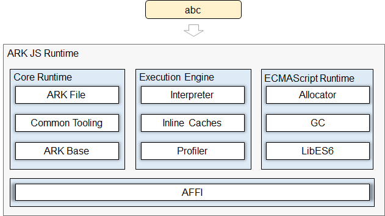

# Overview

ARK is a unified programming platform developed by Huawei. Its key components include a compiler, toolchain, and runtime. ARK supports compilation and running of high-level programming languages on the multi-chip platform and accelerates the running of the OpenHarmony standard operating system and its applications and services on mobile phones, PCs, tablets, TVs, automobiles, and smart wearables. The ARK-JS open sourced this time provides the capability of compiling and running the JavaScript \(JS\) language on the OpenHarmony operating system.

The ARK-JS consists of two parts: JS compiler toolchain and JS runtime. The JS compiler toolchain compiles JS source code into ARK bytecodes. The JS runtime executes the generated ARK bytecodes. Unless otherwise specified, bytecodes refer to ARK bytecodes in this document.

The following figure shows the architecture of the JS compiler toolchain.

The ARK-JS source code compiler receives the JS source code, and ts2abc converts the JS source code into an abc file.

The following figure shows the JS runtime architecture.

ARK-JS Runtime runs ARK bytecode files to implement JS semantic logic.

ARK-JS Runtime consists of the following:

-   Core Runtime

    Core Runtime consists of basic language-irrelevant runtime libraries, including ARK File, Tooling, and ARK Base. ARK File provides bytecodes. Tooling supports Debugger. ARK Base is responsible for implementing system calls.

-   Execution Engine

    The Execution Engine consists of an interpreter that executes bytecodes, Inline Caches that store hidden classes, and Profiler that analyzes and records runtime types.

-   ECMAScript Runtime

    ECMAScript Runtime consists of the JS object allocator, garbage collector \(GC\), and an internal library that supports ECMAScript specifications.

-   ARK Foreign Function Interface \(AFFI\)

    The AFFI provides a C++ function interface for ARK-JS runtime.

Future plan:

-   High-performance TypeScript support

OpenHarmony uses TypeScript \(TS\) as one of its main development languages. TS is simply JS with syntax for static types. The common way to process TS in the industry is to convert TS into JS and execute JS code with JS runtime.

ARK-JS is planned to support the native TS. When compiling the TS source code, ts2abc analyzes and obtains the TS type information and sends the TS type information to ARK-JS runtime. The ARK-JS runtime directly uses the type information to statically generate an inline cache to accelerate bytecode execution.

The TS Ahead of Time \(AOT\) compiler directly converts the source code into high-quality machine code based on the TS type information sent from ts2abc, which greatly improves the running performance.

-   Lightweight Actor concurrency model

ECMAScript does not provide concurrency specifications. The Actor concurrency model is used in the JS engines in the industry to implement concurrent processing. In this model, executors do not share data and communicate with each other using the messaging mechanism. The JS Actor model \(web-worker\) in the industry has defects such as slow startup and high memory usage. ARK-JS is required to provide the Actor implementation that features fast startup and low memory usage to better leverage the device's multi-core feature to improve performance. 

ARK-JS is planned to share immutable objects, built-in code blocks, and method bytecodes in Actor instances based on the Actor memory isolation model to accelerate the startup of JS Actor and reduce memory overhead and implement the lightweight Actor concurrency model.

