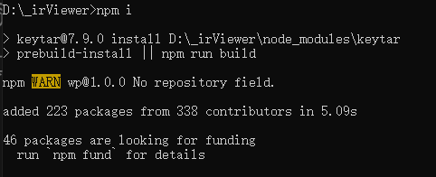
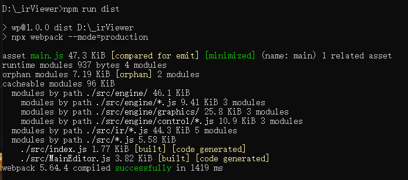
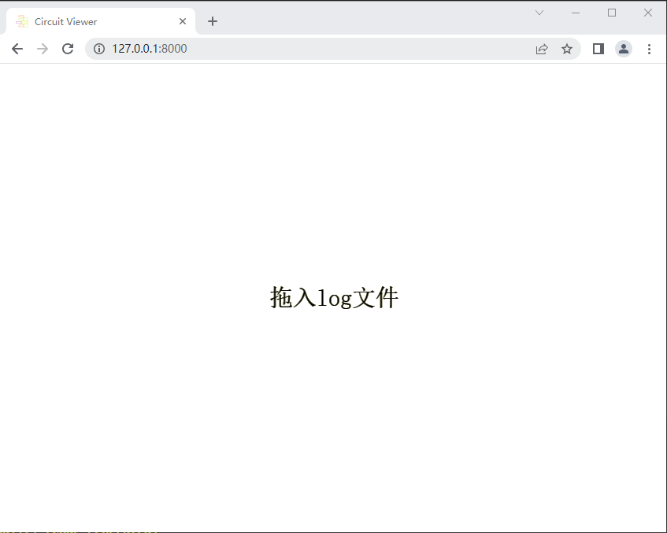
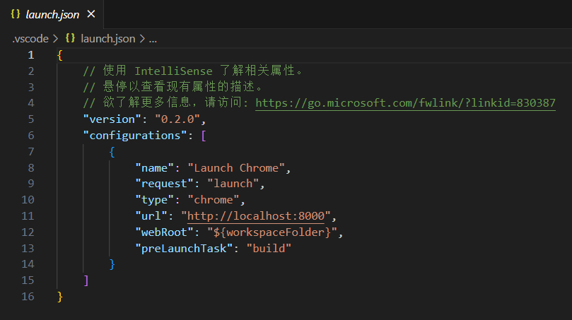

# Circuit IR可视化工具开发说明

若当前工具功能不满足开发者需求，开发者需增强工具能力，则可基于已有源码进行工具二次开发，编译打包生成自定义的工具。

## 使用场景

1. 编译打包发布工具

2. 开发者需增强工具能力，进行二次开发

## 工具开发

### 环境说明

系统：建议Ubuntu 20.04或者Windows 10

### 约束

nodejs v14.20.0

#### 首次下载源码后安装依赖库：

1.右键windows开始菜单，单击运行，输入cmd，单击确定。
	
2.在命令行中进入到circuit_viewer目录下，运行npm i安装依赖库，如下图所示：
	

#### 打包

首次使用工具或本地代码有更新时，需在circuit_viewer目录下运行npm run dist打包源码，如下图所示：

打包成功后会生成dist/main.js文件

#### 运行

本地安装python3，在dist目录内运行python -m http.server启动web服务，如下图所示：

打开chrome浏览器，访问127.0.0.1:8000，如下图所示：

#### 发布

将dist目录下的文件放到web服务器根目录，必要的文件列表如下：

config.json ---- 配置节点和线的颜色
favicon.ico ---- 页面打开后左上角的图标
index.html ----- 页面入口文件
main.js -------- 打包发布的工具主程序文件

#### 开发

源码中，engine目录为自研图形引擎，跟circuit ir相关文件有如下三个：

1. 解析log文件：src/ir/LogParser.js

2. 根据解析结果生成节点和线：src/ir/IrToPicture.js

3. 可视化展示流图：src/ir/IrViewer.js

开发者可以对以上三个文件进行二次开发，增强工具能力

#### 调试

1. 安装chrome浏览器

2. 使用vscode打开工程，创建.vscode目录，新建launch.json(调试配置)，如下图：

3. 新建task.json(打包配置)，如下图：
   

4. 在vscode界面点击F5，将会自动打包和启动调试，在src的源码中可以下断点调试